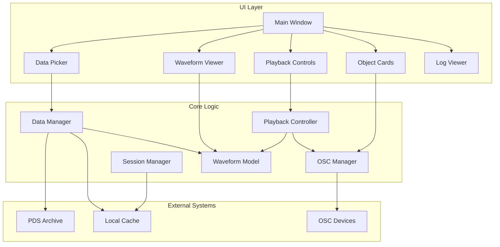

# Red Dust Co

ntrol Center - Implementation Plan

## Architecture Overview

The application follows a modular architecture with clear separation between data management, playback logic, OSC streaming, and UI components.




## Phase 1: Core Functionality (Next Phase)

### 1.1 Project Structure

Create the following directory structure:

```javascript
red_dust_control/
├── main.py                          # Application entry point
├── requirements_windows.txt          # Windows dependencies
├── requirements_mac.txt              # macOS dependencies
├── README.md                         # Setup and usage instructions
├── core/
│   ├── __init__.py
│   ├── data_manager.py              # PDS data fetching and caching
│   ├── waveform_model.py            # Waveform data model and normalization
│   ├── playback_controller.py       # Time-based playback engine
│   ├── osc_manager.py               # OSC streaming at 60 Hz
│   └── session_manager.py           # Save/load application state
├── ui/
│   ├── __init__.py
│   ├── main_window.py               # Main application window
│   ├── data_picker.py               # Data selection UI
│   ├── waveform_viewer.py           # PyQtGraph waveform display
│   ├── playback_controls.py          # Playback control UI
│   ├── object_cards.py              # Interactive object management
│   └── log_viewer.py                # System log display
├── cache/                            # Local data cache (mirrors PDS structure)
│   └── data/
│       └── [network]/
│           └── continuous_waveform/
│               └── [station]/
│                   └── [year]/
│                       └── [doy]/
└── sessions/                         # Saved session files
```


### 1.2 Dependencies and Requirements

**File: `requirements_windows.txt`**

```javascript
PySide6>=6.5.0
obspy>=1.4.0
pyqtgraph>=0.13.0
python-osc>=1.8.0
requests>=2.31.0
numpy>=1.24.0
```

**File: `requirements_mac.txt`**

```javascript
PySide6>=6.5.0
obspy>=1.4.0
pyqtgraph>=0.13.0
python-osc>=1.8.0
requests>=2.31.0
numpy>=1.24.0
```

Note: Requirements are identical for both platforms, but separate files allow for platform-specific additions later.

### 1.3 Data Manager

**File: `core/data_manager.py`Class: `DataManager`**Responsibilities:

- Fetch directory listings from PDS archive
- Download and cache Mini-SEED files
- Load cached data using ObsPy
- Build PDS URLs based on selection parameters
- Manage local cache structure (mirroring PDS)

**Key Methods:**

- `build_pds_url(network: str, station: str, year: int, doy: int, data_type: str = "continuous_waveform") -> str`
- Constructs URL: `https://pds-geosciences.wustl.edu/insight/urn-nasa-pds-insight_seis/data/data/{network}/{data_type}/{station}/{year}/{doy}/`
- `fetch_directory_listing(url: str) -> List[str]`
- Uses `requests` to get HTML directory listing
- Parses links to extract `.mseed` filenames
- Returns list of file URLs to download
- `download_mseed_files(file_urls: List[str], cache_path: Path) -> List[Path]`
- Downloads each `.mseed` file to cache directory
- Preserves PDS directory structure: `cache/data/{network}/{data_type}/{station}/{year}/{doy}/`
- Returns list of local file paths
- Handles download failures gracefully (log warning, skip file)
- `load_from_cache(cache_path: Path) -> obspy.Stream`
- Uses `obspy.read()` to load all `.mseed` files from cache directory
- Merges traces when possible
- Returns ObsPy Stream with all channels
- Raises exception if no valid data found
- `is_cached(network: str, station: str, year: int, doy: int) -> bool`
- Checks if data exists in local cache
- Returns True if cache directory exists and contains `.mseed` files
- `get_cache_path(network: str, station: str, year: int, doy: int) -> Path`
- Returns local cache path following PDS structure

**Error Handling:**

- Network failures: Log warning, return empty list
- Parse failures: Log error, skip corrupted file
- No data found: Raise exception with clear message

**Architecture Note:** Structure methods to accept `data_type` parameter (default "continuous_waveform") to enable future event waveform support without code changes.

### 1.4 Waveform Model

**File: `core/waveform_model.py`Class: `WaveformModel`**Responsibilities:

- Store ObsPy Stream with all channels
- Track active channel selection
- Provide normalized values (0..1) with dynamic scaling
- Preserve UTC timestamps

**Key Methods:**

- `__init__(stream: obspy.Stream)`
- Store stream
- Extract all unique channel codes
- Set first channel as active by default
- Initialize normalization parameters (P1-P99 percentile clamping)
- `get_all_channels() -> List[str]`
- Returns list of channel codes (e.g., ["03.BHU", "03.BHV", "05.LMU"])
- `set_active_channel(channel: str) -> None`
- Sets active channel for playback/streaming
- Recalculates normalization parameters for new channel
- Emits signal/event for UI update
- `get_active_channel() -> str`
- Returns currently active channel code
- `get_normalized_value(timestamp: UTCDateTime) -> float`
- Gets value from active channel at given timestamp
- Applies percentile clamping (default P1-P99)
- Maps to 0..1 range (handles negative values by shifting)
- Returns 0.0 if timestamp out of range
- `update_scaling(lo_percentile: float, hi_percentile: float) -> None`
- Updates normalization range (e.g., P5-P95 for tighter range)
- Recalculates min/max values from active channel
- Emits signal for UI update
- `get_time_range() -> Tuple[UTCDateTime, UTCDateTime]`
- Returns (start_time, end_time) of active channel
- `get_sample_rate() -> float`
- Returns sample rate of active channel

**Normalization Algorithm:**

1. Extract all values from active channel
2. Calculate percentiles (default: 1st and 99th)
3. Clamp values to percentile range
4. Map to 0..1: `normalized = (value - min) / (max - min)`
5. Ensure no negative output values

### 1.5 Playback Controller

**File: `core/playback_controller.py`Class: `PlaybackController`**Responsibilities:

- Time-based playback using real UTC timestamps
- Manage playback state (stopped, playing, paused)
- Control playback speed
- Handle loop ranges (minimum 2 seconds)

**Key Methods:**

- `__init__(waveform_model: WaveformModel)`
- Store reference to waveform model
- Initialize state: stopped
- Set default speed: 1.0x
- Initialize loop range: None
- `start() -> None`
- Start playback from current position (or start if stopped)
- Set state to playing
- Start timer for playhead updates
- `pause() -> None`
- Pause playback, maintain current position
- Set state to paused
- `stop() -> None`
- Stop playback, reset to start
- Set state to stopped
- `set_speed(multiplier: float) -> None`
- Set playback speed (0.1x to 10.0x)
- Adjusts timer interval accordingly
- `set_loop_range(start_time: UTCDateTime, end_time: UTCDateTime) -> None`
- Set loop range (enforced minimum 2 seconds)
- Validate range is within data bounds
- `enable_loop(enabled: bool) -> None`
- Enable/disable looping
- `get_current_timestamp() -> UTCDateTime`
- Returns current playhead position
- `get_playback_state() -> str`
- Returns: "stopped", "playing", or "paused"

**Implementation Details:**

- Use `QTimer` for playhead updates (60 Hz for smooth UI)
- Calculate real-time position: `current = start + (elapsed * speed)`
- On loop: reset to loop start when reaching loop end
- Emit signals for playhead updates (for waveform viewer)

### 1.6 OSC Manager

**File: `core/osc_manager.py`Class: `OSCManager`**Responsibilities:

- Manage multiple OSC clients (one per interactive object)
- Stream normalized data at fixed 60 Hz rate
- Include timestamps in OSC messages
- Handle per-object scaling

**Class: `OSCObject`**Attributes:

- `name: str` - Unique identifier
- `address: str` - OSC address (e.g., "/red_dust/object1")
- `host: str` - Target IP address
- `port: int` - Target UDP port
- `scale: float` - Output scaling factor (0..1, caps max value)
- `enabled: bool` - Active/inactive state

**Key Methods (OSCManager):**

- `__init__()`
- Initialize empty object dictionary
- Create QTimer for 60 Hz output (16.67ms interval)
- Connect timer to streaming function
- `add_object(name: str, address: str, host: str, port: int, scale: float = 1.0) -> OSCObject`
- Create new OSCObject
- Create python-osc UDPClient
- Store in dictionary
- Return object reference
- `remove_object(name: str) -> None`
- Remove object and close client
- `update_object_scale(name: str, scale: float) -> None`
- Update scaling factor for object
- `set_object_enabled(name: str, enabled: bool) -> None`
- Enable/disable object streaming
- `start_streaming() -> None`
- Start 60 Hz timer
- Begin sending values
- `stop_streaming() -> None`
- Stop timer
- Send zero values to all objects (explicit silence)
- `send_frame(normalized_value: float, timestamp: UTCDateTime) -> None`
- Called by timer at 60 Hz
- For each enabled object:
    - Apply object scaling: `output_value = normalized_value * object.scale`
    - Create OSC message with address
    - Include two arguments: `(output_value: float, timestamp: str)`
    - Timestamp format: ISO8601 UTC string (e.g., "2023-09-29T12:34:56.789Z")
    - Send via UDPClient

**OSC Message Format:**

```javascript
/red_dust/object1 float(0.0-1.0) string(ISO8601_timestamp)
```

**Implementation Details:**

- Use `python-osc` library: `from pythonosc.udp_client import UDPClient`
- Resample data: If source sample rate < 60 Hz, repeat last value; if > 60 Hz, sample at 60 Hz intervals
- Always send values (even 0.0) to maintain connection

### 1.7 Session Manager

**File: `core/session_manager.py`Class: `SessionManager`**Responsibilities:

- Save application state to JSON
- Load application state from JSON
- Manage session file storage

**Session JSON Structure:**

```json
{
  "dataset": {
    "network": "XB",
    "station": "ELYSE",
    "year": 2019,
    "doy": 100
  },
  "active_channel": "03.BHU",
  "scaling": {
    "lo_percentile": 1.0,
    "hi_percentile": 99.0
  },
  "playback": {
    "speed": 1.0,
    "loop_enabled": false,
    "loop_start": null,
    "loop_end": null
  },
  "objects": [
    {
      "name": "Object 1",
      "address": "/red_dust/object1",
      "host": "192.168.1.100",
      "port": 8000,
      "scale": 0.7,
      "enabled": true
    }
  ]
}
```

**Key Methods:**

- `save_session(file_path: Path, state: dict) -> None`
- Serialize state to JSON
- Write to file
- `load_session(file_path: Path) -> dict`
- Read JSON file
- Return state dictionary
- Handle file not found / invalid JSON
- `create_state_dict(data_manager, waveform_model, playback_controller, osc_manager) -> dict`
- Collect current state from all managers
- Return structured dictionary

### 1.8 Main Window

**File: `ui/main_window.py`Class: `MainWindow(QMainWindow)`**Layout structure (4 rows using QVBoxLayout):**Row 1: Data Overview**

- Left: Metadata viewer (QLabel or QTextEdit, read-only)
- Display: Network, Station, Year, DOY
- Active channel info: code, sample rate, time range
- Right: Waveform viewer (custom widget)

**Row 2: Data Selection and Playback**

- Left: Data picker widget
- Right: Playback controls widget

**Row 3: Interactive Objects**

- Scrollable area with object cards
- Add/Remove buttons

**Row 4: System Log**

- QTextEdit (read-only) with monospace font
- Auto-scroll to bottom

**Key Methods:**

- `__init__()`
- Initialize all UI components
- Create core managers (DataManager, WaveformModel, etc.)
- Connect signals/slots
- Load last session if available
- `connect_signals() -> None`
- Wire up UI actions to core logic
- Connect playback updates to waveform viewer
- Connect log messages to log viewer

### 1.9 Data Picker UI

**File: `ui/data_picker.py`Class: `DataPicker(QWidget)`**Components:

- Network dropdown (QComboBox): Default "XB", editable if needed
- Station dropdown (QComboBox): ["ELYSE", "ELYS0", "ELYHK", "ELYH0"]
- Date picker (QDateEdit): Calendar widget
- Convert selected date to year and DOY
- Display in user-friendly format
- "Load Data" button (QPushButton)
- Loading indicator (QLabel or QProgressBar)

**Key Methods:**

- `get_selection() -> dict`
- Returns: `{"network": str, "station": str, "year": int, "doy": int}`
- `date_to_doy(date: QDate) -> Tuple[int, int]`
- Convert QDate to (year, day_of_year)
- Handle leap years correctly
- `on_load_clicked() -> None`
- Emit signal with selection parameters
- Show loading indicator
- Disable controls during load

**Date to DOY Conversion:**

```python
from datetime import datetime
date_obj = date.toPython()  # QDate to Python date
year = date_obj.year
doy = date_obj.timetuple().tm_yday
```


### 1.10 Waveform Viewer

**File: `ui/waveform_viewer.py`Class: `WaveformViewer(pg.PlotWidget)`**Using PyQtGraph for performance.**Features:**

- Display all channels (stacked vertically or color-coded overlay)
- Highlight active channel (thicker line, different color)
- Playhead indicator (vertical line, moves with playback)
- Loop range visualization (shaded region)
- Zoom/pan controls (mouse wheel, drag)
- Time axis shows UTC timestamps

**Key Methods:**

- `update_waveform(stream: obspy.Stream, active_channel: str) -> None`
- Clear existing plots
- Plot all channels
- Highlight active channel
- Update time axis
- `update_playhead(timestamp: UTCDateTime) -> None`
- Move playhead line to current position
- `set_loop_range(start: UTCDateTime, end: UTCDateTime) -> None`
- Draw shaded region for loop range
- `on_mouse_click(event) -> None`
- Allow click-drag to select loop range
- Emit signal with selected range

**Implementation:**

- Use `pg.PlotWidget` as base
- Plot each channel: `plot(x_data, y_data, pen=color)`
- Store plot items for easy updates
- Use `pg.InfiniteLine` for playhead

### 1.11 Playback Controls UI

**File: `ui/playback_controls.py`Class: `PlaybackControls(QWidget)`**Components:

- Play button (QPushButton, icon: ▶)
- Pause button (QPushButton, icon: ⏸)
- Stop button (QPushButton, icon: ⏹)
- Speed control (QDoubleSpinBox): Range 0.1 to 10.0, step 0.1
- Loop checkbox (QCheckBox): "Enable Loop"
- Time display (QLabel): "Current / Total" (e.g., "12:34:56 / 24:00:00")
- Loop range display (QLabel): "Loop: 12:00:00 - 14:00:00" (or "No loop")

**Key Methods:**

- `update_time_display(current: UTCDateTime, total: UTCDateTime) -> None`
- Format timestamps as HH:MM:SS
- Update label
- `update_loop_display(start: UTCDateTime, end: UTCDateTime) -> None`
- Show loop range or "No loop"
- `on_play_clicked() -> None`
- Emit signal to start playback
- `on_speed_changed(value: float) -> None`
- Emit signal to update playback speed

### 1.12 Object Cards UI

**File: `ui/object_cards.py`Class: `ObjectCard(QWidget)`**Individual card widget for each OSC object.**Components:**

- Name field (QLineEdit)
- OSC Address (QLineEdit): Default "/red_dust/..."
- Host (QLineEdit): IP address
- Port (QSpinBox): Range 1-65535
- Scale slider (QSlider): Range 0-100 (display as 0.0-1.0)
- Enable checkbox (QCheckBox)
- Remove button (QPushButton, icon: ✕)

**Class: `ObjectCardsContainer(QWidget)`**Container for multiple object cards.**Components:**

- Scrollable area (QScrollArea)
- "Add Object" button
- Grid/layout of object cards

**Key Methods:**

- `add_object(name: str = "New Object") -> ObjectCard`
- Create new card
- Add to layout
- Return card reference
- `remove_object(card: ObjectCard) -> None`
- Remove card from layout
- Delete widget
- `get_all_objects() -> List[dict]`
- Collect configuration from all cards
- Return list of dictionaries

### 1.13 Log Viewer

**File: `ui/log_viewer.py`Class: `LogViewer(QTextEdit)`**Simple read-only text widget for system logs.**Features:**

- Monospace font
- Auto-scroll to bottom on new messages
- Color coding (optional): INFO (black), WARNING (orange), ERROR (red)

**Key Methods:**

- `append_log(level: str, message: str) -> None`
- Format: `[LEVEL] HH:MM:SS - message`
- Append to text
- Scroll to bottom

### 1.14 Application Entry Point

**File: `main.py`**

```python
import sys
from PySide6.QtWidgets import QApplication
from ui.main_window import MainWindow

def main():
    app = QApplication(sys.argv)
    window = MainWindow()
    window.show()
    sys.exit(app.exec())

if __name__ == "__main__":
    main()
```


### 1.15 Logging System

**File: `core/logger.py` (optional, or integrate into main_window)**Centralized logging that outputs to both console and UI log viewer.**Implementation:**

- Use Python `logging` module
- Custom handler that emits Qt signals
- Connect signal to log viewer's `append_log` method

## Phase 2: Future Work

### 2.1 Event Waveform Support

**Changes Required:**

- Extend `DataManager.build_pds_url()` to handle `data_type="event_waveform"` and `event_id` parameter
- Add event ID input to data picker UI
- Update cache structure to include event waveform directories
- No changes needed to WaveformModel or PlaybackController (already data-type agnostic)

### 2.2 Audio Output Preview

- Add audio output using PyAudio or similar
- Map normalized values to audio samples
- Volume control
- Optional: real-time audio during playback

### 2.3 Advanced Visualization

- Spectrogram view
- Frequency domain analysis
- Multi-panel views (time + frequency)
- Export waveform images

### 2.4 Enhanced Features

- Filter presets (high-pass, low-pass) - requires ObsPy filtering
- Export normalized data to CSV/JSON
- Multi-dataset queuing/playlist
- Keyboard shortcuts for common actions
- Dark/light theme toggle
- Cache management UI (view size, clear cache)
- Data validation and quality indicators

### 2.5 Performance Optimizations

- Lazy loading for large datasets
- Data decimation for visualization (show overview, detail on zoom)
- Background data loading
- Progress indicators for long operations

## Implementation Priority

**Sprint 1: Foundation**

1. Project structure and requirements files
2. Data Manager (PDS fetching, caching)
3. Basic main window layout

**Sprint 2: Data Loading & Visualization**

1. Data Picker UI
2. Waveform Model
3. Waveform Viewer (basic display)

**Sprint 3: Playback Engine**

1. Playback Controller
2. Playback Controls UI
3. Integration with waveform viewer (playhead)

**Sprint 4: OSC Streaming**

1. OSC Manager
2. Object Cards UI
3. Integration with playback (60 Hz streaming)

**Sprint 5: Polish & Session Management**

1. Session Manager
2. Logging system
3. Error handling improvements
4. UI refinements and testing

## Key Technical Decisions

1. **Qt Version**: PySide6 (LGPL license, more permissive)
2. **Normalization**: Default P1-P99 percentile clamping, adjustable via UI
3. **Loop Selection**: Click-drag on waveform viewer to select range
4. **OSC Timestamp Format**: ISO8601 UTC string for human readability and debugging
5. **Cache Structure**: Exact mirror of PDS directory structure for easy navigation
6. **Data Type Abstraction**: All core classes accept `data_type` parameter to enable future event waveform support without refactoring

## Testing Considerations

- Test with various DOY values (including leap years)
- Test network failure scenarios
- Test with corrupted Mini-SEED files